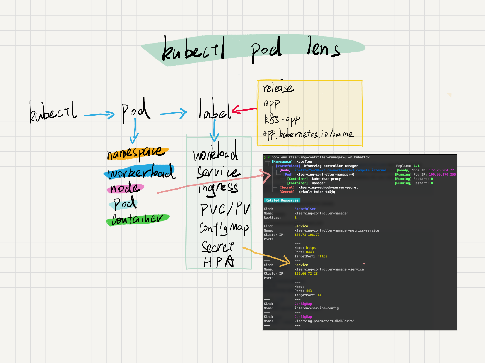
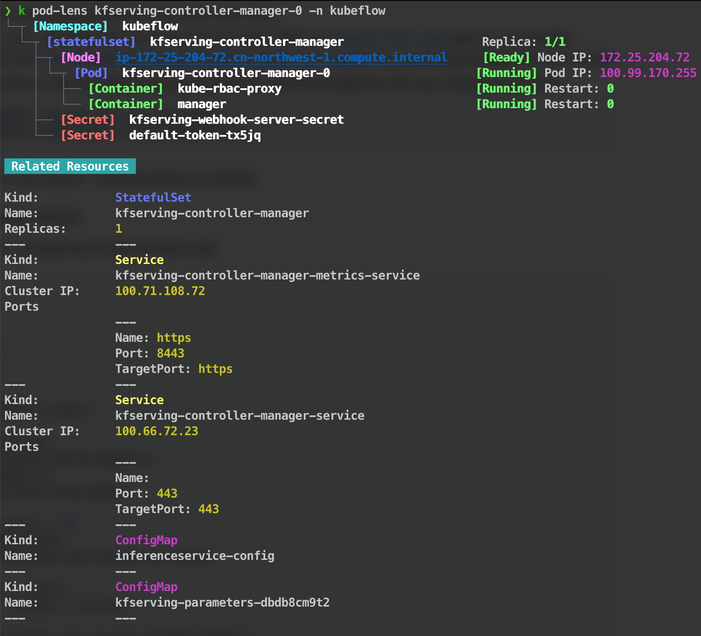

# Kubectl PodLens

## 插件背景
该插件使用树状图和表格展示 pod 相关资源，在排查问题可以非常方便的查看 Pod 相关资源信息和状态。

### 版本要求

- Kubernetes 1.10.0+
- Kubectl 1.13.0+

## 原理


## 编译安装

```sh

# 下载代码
$ git clone  https://gitlab-ce.alauda.cn/ops/kubectl-plugins.git
$ cd kubectl-plugins/kubectl-podlens/cmd/plugin

# 编译命令(确保你有一个可用的kubeconfig)
$ GO111MODULE="on" go build -ldflags '-w -s'   -o kubectl-podlens .

# 将构建的二进制文件放到可执行路径中
$ cp kubectl-podlens /usr/local/bin/

#现在可以开始将此插件作为常规kubectl命令使用：

```
## 用法


## 使用帮助
```sh
Usage:
  kubectl podlens [pod name] [flags]

Examples:

# Interactive operation
$ kubectl podlens
# Show pod-related resources
$ kubectl podlens prometheus-prometheus-operator-prometheus-0

The plugin can display pod-related:
* Workloads(Deployment,StatefulSet,DaemonSet)
* Namespace
* Node
* Service
* Ingress
* ConfigMap
* Secret
* HPA
* PodDisruptionBudget (PDB)

```

## 清除插件

您只需从路径中删除该插件，即可从kubectl“卸载”该插件：

    $ rm /usr/local/bin/kubectl-podlens

## 项目来自于哪里？

`kubectl-podlens` 来自于:

https://github.com/sunny0826/kubectl-pod-lens