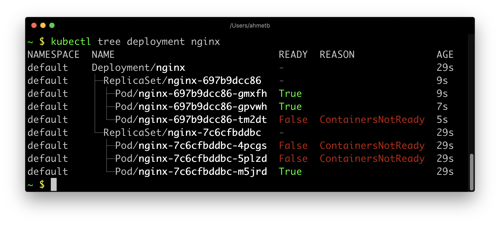
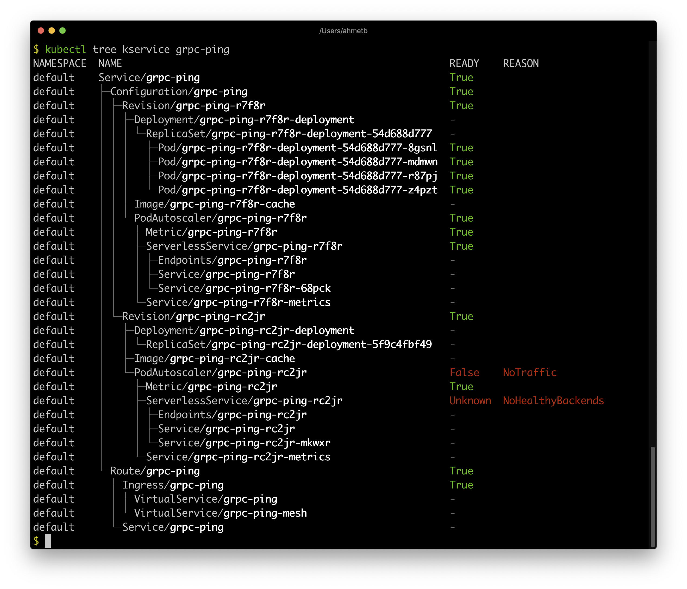
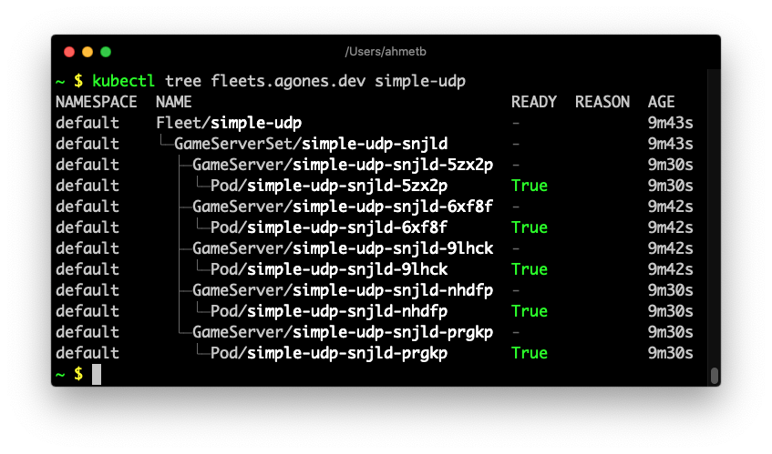

# kubectl tree

## 插件背景
一个kubectl插件，用于探索Kubernetes对象之间的所有权关系。

## 原理
待补充

## 编译安装

```sh

# 下载代码
$ git clone  https://gitlab-ce.alauda.cn/ops/kubectl-plugins.git
$ cd kubectl-plugins/kubectl-tree/cmd/kubectl-tree

# 编译命令(确保你有一个可用的kubeconfig)
$ GO111MODULE="on" go build -ldflags '-w -s' .

# 将构建的二进制文件放到可执行路径中
$ cp kubectl-tree /usr/local/bin/

#现在可以开始将此插件作为常规kubectl命令使用：

```

## 用法

例如 (Deployment):



例如 (Service):



例如 (Agones Fleet):



## 使用帮助
```sh
Usage:
  kubectl tree KIND NAME [flags]

Examples:
  kubectl tree deployment my-app
  kubectl tree kservice.v1.serving.knative.dev my-app
```

## 清除插件

您只需从路径中删除该插件，即可从kubectl“卸载”该插件：

    $ rm /usr/local/bin/kubectl-tree

## 项目来自于哪里？

`kubectl-tree` 来自于:

https://github.com/ahmetb/kubectl-tree
